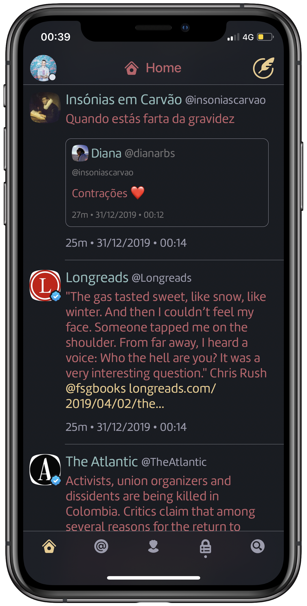
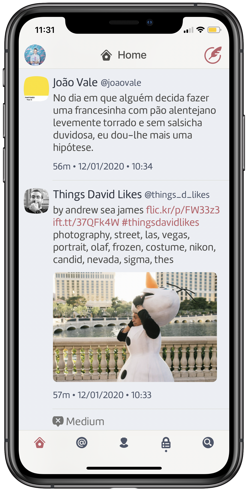

# twitterrific-nordtheme
Nord theme for Twitterrific

Trying to port [Arctic Ice Studio's Nord Theme](https://www.nordtheme.com) to Iconfactory's [Twitterrific](https://twitterrific.com/ios). 

Still a lot to do...  

## Install
1. Download the [TwitterrificNord.twitterrifictheme](TwitterrificNord.twitterrifictheme) file to your computer
2. Put it in your iCloud Drive folder: /Twitterrific/Themes/Dark/
3. You can now use it on macOS and iOS by selecting the theme

Note: only tested on iOS so far, might not work on MacOS

## Darker Version

## Install
1. Download the [TwitterrificNordDark.twitterrifictheme](TwitterrificNordDark.twitterrifictheme) file to your computer
2. Put it in your iCloud Drive folder: /Twitterrific/Themes/Dark/
3. You can now use it on macOS and iOS by selecting the theme

Note: only tested on iOS so far, might not work on MacOS

## Light Version 

## Install
1. Download the [TwitterrificNordLight.twitterrifictheme](TwitterrificNordLight.twitterrifictheme) file to your computer
2. Put it in your iCloud Drive folder: /Twitterrific/Themes/Light/
3. You can now use it on macOS and iOS by selecting the theme

Note: only tested on iOS so far, might not work on MacOS

